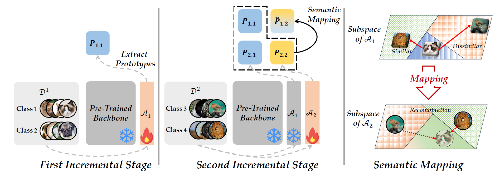
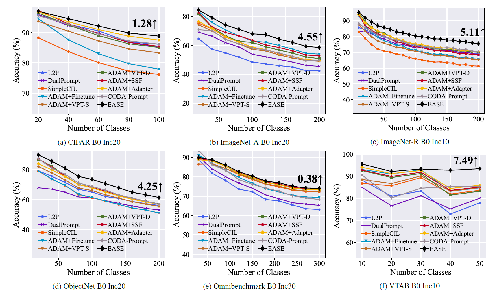
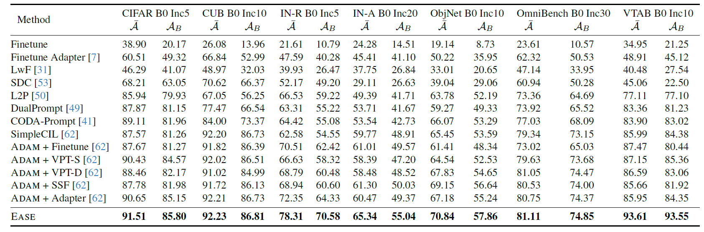

# Expandable Subspace Ensemble for Pre-Trained Model-Based Class-Incremental Learning

<p align="center">
  <a href=""></a>
  <a href=""></a>
  <a href=""></a>
</p>

🎉The code repository for "Expandable Subspace Ensemble for Pre-Trained Model-Based Class-Incremental Learning"  [[paper]](https://arxiv.org/abs/2403.12030)(CVPR24) in PyTorch. If you use any content of this repo for your work, please cite the following bib entry:

```
  @inproceedings{zhou2024expandable,
    title={Expandable Subspace Ensemble for Pre-Trained Model-Based Class-Incremental Learning},
    author={Zhou, Da-Wei and Sun, Hai-Long and Ye, Han-Jia and Zhan, De-Chuan},
    booktitle={CVPR},
    pages={23554--23564},
    year={2024}
  }
```

## Expandable Subspace Ensemble for Pre-Trained Model-Based Class-Incremental Learning

Class-Incremental Learning (CIL) requires a learning system to continually learn new classes without forgetting. Despite the strong performance of Pre-Trained Models (PTMs) in CIL, a critical issue persists: learning new classes often results in the overwriting of old ones. Excessive modification of the network causes forgetting, while minimal adjustments lead to an inadequate fit for new classes. As a result, it is desired to figure out a way of efficient model updating without harming former knowledge.

In this paper, we propose ExpAndable Subspace Ensemble (EASE) for PTM-based CIL. To enable model updating without conflict, we train a distinct lightweight adapter module for each new task, aiming to create task-specific subspaces. These adapters span a high-dimensional feature space, enabling joint decision-making across multiple subspaces. As data evolves, the expanding subspaces render the old class classifiers incompatible with new-stage spaces. Correspondingly, we design a semantic-guided prototype complement strategy that synthesizes old classes’ new features without using any old class instance. Extensive experiments on seven benchmark datasets verify EASE’s state-of-the-art performance.



## 🎊 Results

We conducted experiments on seven benchmark datasets to verify the competitive performance of EASE.





## Requirements
### 🗂️ Environment
1. [torch 2.0.1](https://github.com/pytorch/pytorch)
2. [torchvision 0.15.2](https://github.com/pytorch/vision)
3. [timm 0.6.12](https://github.com/huggingface/pytorch-image-models)

### 🔎 Dataset
We provide the processed datasets as follows:
- **CIFAR100**: will be automatically downloaded by the code.
- **CUB200**:  Google Drive: [link](https://drive.google.com/file/d/1XbUpnWpJPnItt5zQ6sHJnsjPncnNLvWb/view?usp=sharing) or Onedrive: [link](https://entuedu-my.sharepoint.com/:u:/g/personal/n2207876b_e_ntu_edu_sg/EVV4pT9VJ9pBrVs2x0lcwd0BlVQCtSrdbLVfhuajMry-lA?e=L6Wjsc)
- **ImageNet-R**: Google Drive: [link](https://drive.google.com/file/d/1SG4TbiL8_DooekztyCVK8mPmfhMo8fkR/view?usp=sharing) or Onedrive: [link](https://entuedu-my.sharepoint.com/:u:/g/personal/n2207876b_e_ntu_edu_sg/EU4jyLL29CtBsZkB6y-JSbgBzWF5YHhBAUz1Qw8qM2954A?e=hlWpNW)
- **ImageNet-A**: Google Drive: [link](https://drive.google.com/file/d/19l52ua_vvTtttgVRziCZJjal0TPE9f2p/view?usp=sharing) or Onedrive: [link](https://entuedu-my.sharepoint.com/:u:/g/personal/n2207876b_e_ntu_edu_sg/ERYi36eg9b1KkfEplgFTW3gBg1otwWwkQPSml0igWBC46A?e=NiTUkL)
- **OmniBenchmark**: Google Drive: [link](https://drive.google.com/file/d/1AbCP3zBMtv_TDXJypOCnOgX8hJmvJm3u/view?usp=sharing) or Onedrive: [link](https://entuedu-my.sharepoint.com/:u:/g/personal/n2207876b_e_ntu_edu_sg/EcoUATKl24JFo3jBMnTV2WcBwkuyBH0TmCAy6Lml1gOHJA?e=eCNcoA)
- **VTAB**: Google Drive: [link](https://drive.google.com/file/d/1xUiwlnx4k0oDhYi26KL5KwrCAya-mvJ_/view?usp=sharing) or Onedrive: [link](https://entuedu-my.sharepoint.com/:u:/g/personal/n2207876b_e_ntu_edu_sg/EQyTP1nOIH5PrfhXtpPgKQ8BlEFW2Erda1t7Kdi3Al-ePw?e=Yt4RnV)
- **ObjectNet**: Onedrive: [link](https://entuedu-my.sharepoint.com/:u:/g/personal/n2207876b_e_ntu_edu_sg/EZFv9uaaO1hBj7Y40KoCvYkBnuUZHnHnjMda6obiDpiIWw?e=4n8Kpy) You can also refer to the [filelist](https://drive.google.com/file/d/147Mta-HcENF6IhZ8dvPnZ93Romcie7T6/view?usp=sharing) if the file is too large to download.

You need to modify the path of the datasets in `./utils/data.py`  according to your own path.
> These datasets are referenced in the [ADAM](https://github.com/zhoudw-zdw/RevisitingCIL) 

## 🔑 Running scripts

Please follow the settings in the `exps` folder to prepare json files, and then run:

```
python main.py --config ./exps/[filename].json
```

**Here is an example of how to run the code** 

if you want to run the cifar dataset using ViT-B/16-IN1K, you can follow the script: 
```
python main.py --config ./exps/ease_cifar.json
```

if you want to run the cifar dataset using ViT-B/16-IN21K, you can follow the script: 
```
python main.py --config ./exps/ease_cifar_in21k.json
```

After running the code, you will get a log file in the `logs/ease/cifar224/` folder.

## 👨‍🏫 Acknowledgment

We would like to express our gratitude to the following repositories for offering valuable components and functions that contributed to our work.

- [PILOT: A Pre-Trained Model-Based Continual Learning Toolbox](https://github.com/sun-hailong/LAMDA-PILOT)
- [RevisitingCIL](https://github.com/zhoudw-zdw/RevisitingCIL)
